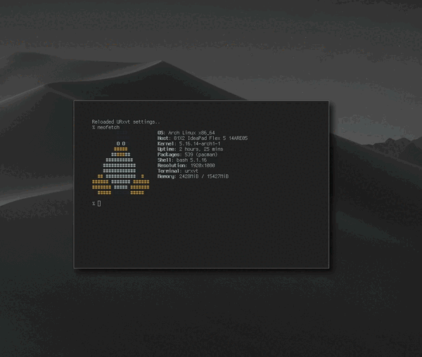

# titlebars-bspwm

## Video Demo

## Checklist
- [ ] Close, Minimize and Maximize buttons on title bar
- [ ] Actual configuration system

## How do you use this?
1. Install the lemonbar config to `~/.config/bar/bar.sh`
2. Install shell script to `~/.config/bspwm/titlebars.sh`
3. Run lemonbar with the following command: `bash ~/.config/bar/bar.sh | lemonbar -B "#000"` (note: `#000` can be changed if you want)
4. Run shell script: `./.config/bspwm/titlebar.sh`
